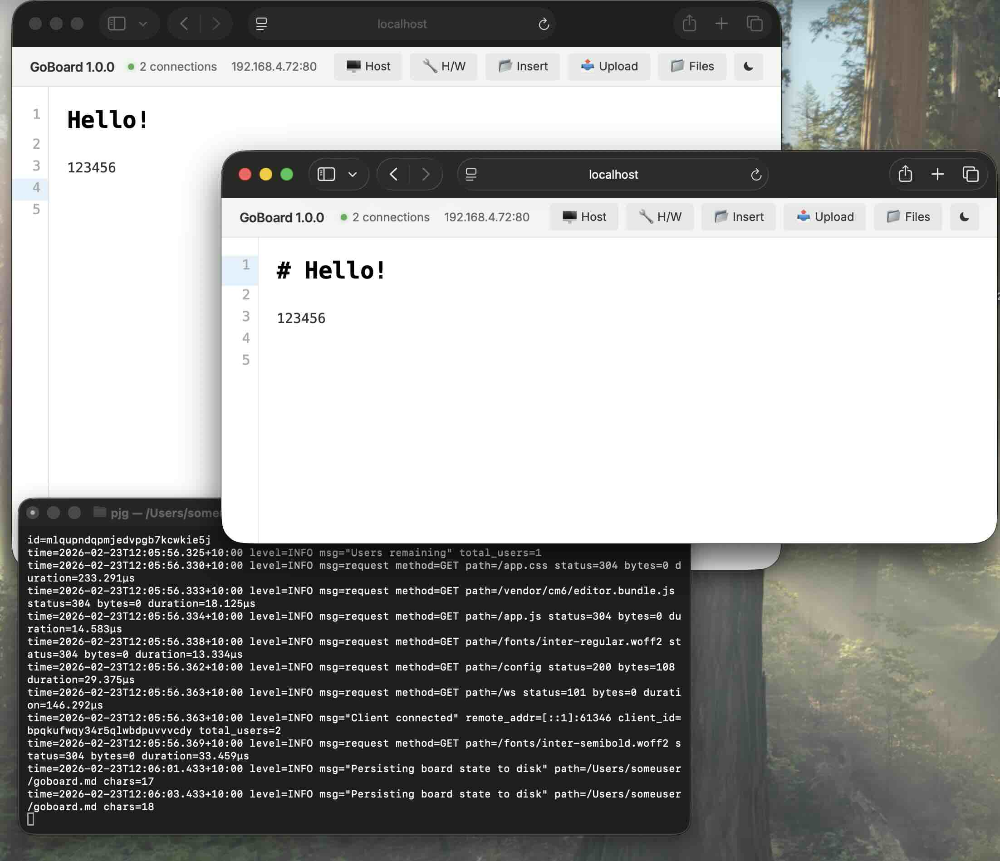

# GoBoard
Collaborative Markdown editor for your network.
Inspired by Google(c) Docs and Obsidian  

## Features
Edit the same document  
WYSIWYM view  
Small single binary  
TOML configuration  
Hardware and host OS information  
File uploading and hosting  
Cross-platform  

## Build tools
```
go
node
npm
mise # (optional)
```

## Build and run
```
cd goboard
go run build.go
./build/goboard
```

or, mise:
```
mise r build:goboard && mise r run:goboard
```

mise 
## Libraries used
```
Javascript
    CodeMirror 6

Go
	"github.com/go-chi/chi/v5"
	"github.com/shirou/gopsutil/v4/process"
    "github.com/BurntSushi/toml"
	"github.com/jaypipes/ghw"
	"github.com/shirou/gopsutil/v4/cpu"
	"github.com/shirou/gopsutil/v4/disk"
	"github.com/shirou/gopsutil/v4/docker"
	"github.com/shirou/gopsutil/v4/host"
	"github.com/shirou/gopsutil/v4/load"
	"github.com/shirou/gopsutil/v4/mem"
	"github.com/shirou/gopsutil/v4/net"
	"github.com/shirou/gopsutil/v4/sensors"
    go-winres
```

## 📸


# Incomplete
Editor  
Docker config  
Caddy config  
Rust port  
mise config could be better  

